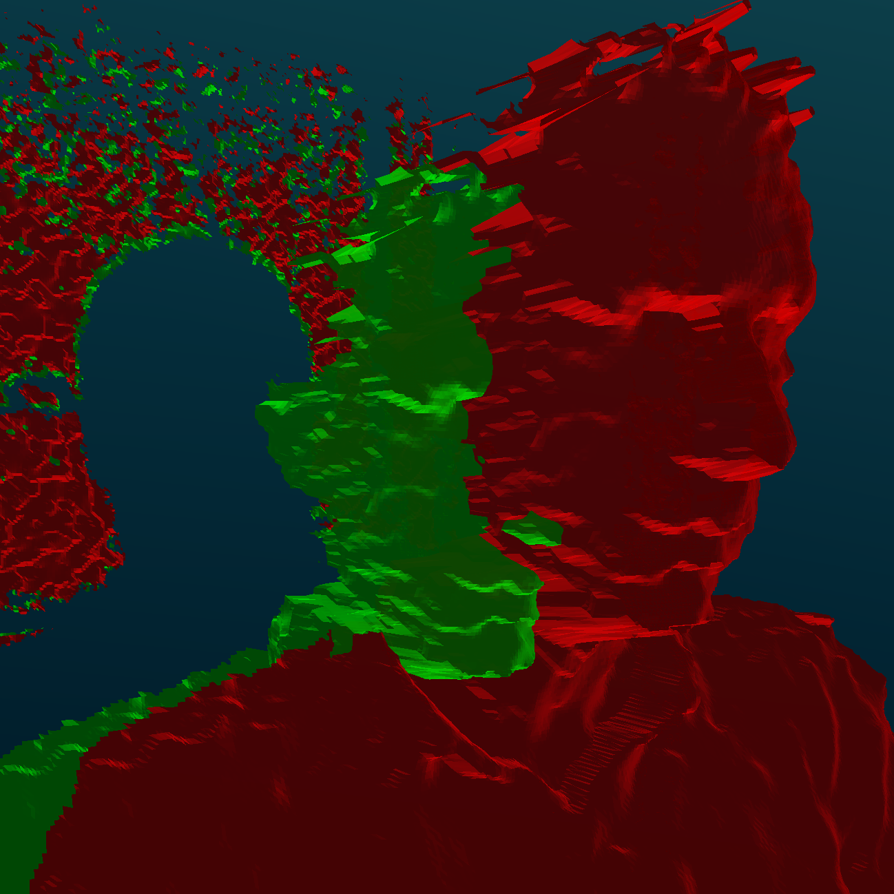
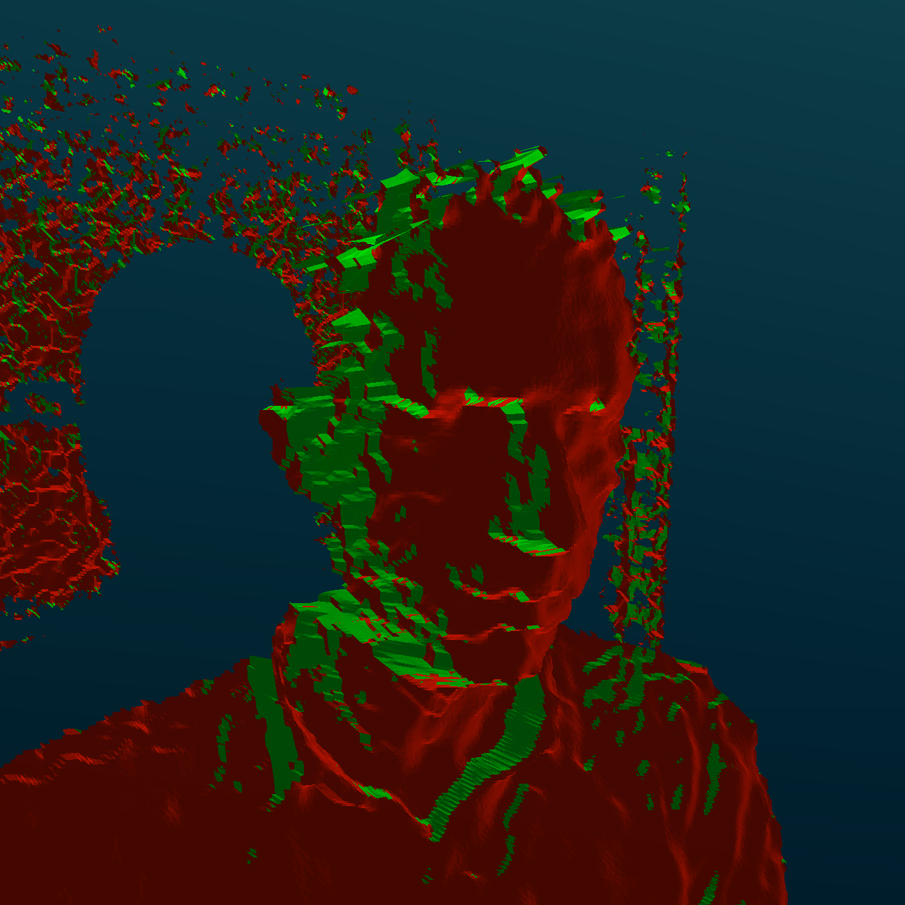

# Iterative Random Concensus Projection

given source set  and destination set with normals , find the best transformation  such that:


  


 

### Refrences
[ [1](https://apps.dtic.mil/sti/pdfs/ADA460585.pdf) ]Fischler, Martin A., and Robert C. Bolles. "Random sample consensus: a paradigm for model fitting with applications to image analysis and automated cartography." Communications of the ACM 24.6 (1981): 381-395.

[ [2](https://www.researchgate.net/profile/Steven_Blostein/publication/224378053_Least-squares_fitting_of_two_3-D_point_sets_IEEE_T_Pattern_Anal/links/5633c61a08aeb786b7013b28/Least-squares-fitting-of-two-3-D-point-sets-IEEE-T-Pattern-Anal.pdf) ] Arun, K. Somani, Thomas S. Huang, and Steven D. Blostein. "Least-squares fitting of two 3-D point sets." IEEE Transactions on pattern analysis and machine intelligence 5 (1987): 698-700.

[ [3](http://citeseerx.ist.psu.edu/viewdoc/download?doi=10.1.1.116.7292&rep=rep1&type=pdf) ]  Low, Kok-Lim. "Linear least-squares optimization for point-to-plane icp surface registration." Chapel Hill, University of North Carolina 4.10 (2004): 1-3.

 
## install
* verified on:
    * ubuntu18.04 | python 3.6 | cuda-11.0
    * ubuntu20.04 | python 3.8 | cuda-11.5
### prequisites

* cuda >= 11
    * ``` sudo apt install nvidia-driver-XXX```
	* https://developer.nvidia.com/cuda-downloads
	* run the installer (ignore warning)
	* install the toolkit (no need for the drivers)
* cmake >= 3.15
    * install:
	* ```sudo apt remove --purge cmake;	sudo snap install cmake --classic```

* ```sudo apt-get install libgflags-dev libopencv-dev libboost-all-dev python3.6-dev```

### package

```
python -m venv venv
source venv/bin/activate
# pip install git+https://github.com/ohadmen/pyircp 
python3 setup.py install
```
